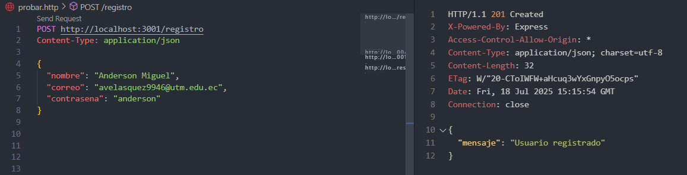
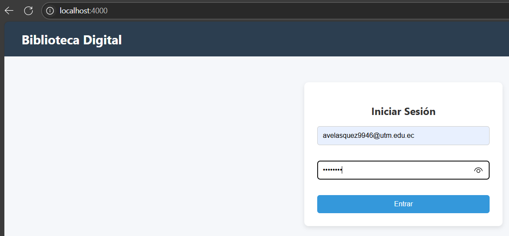
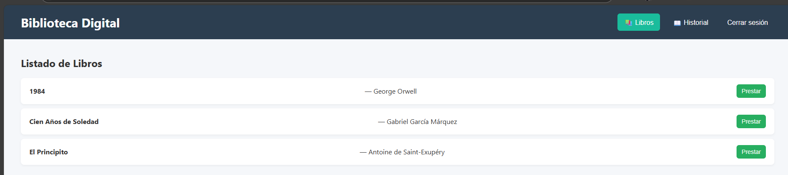
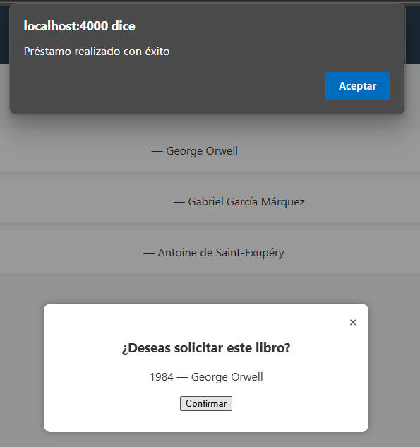
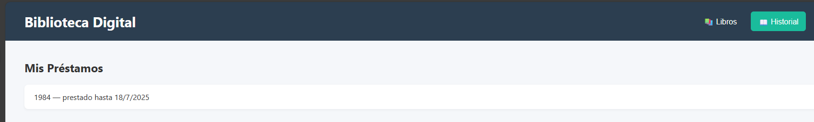
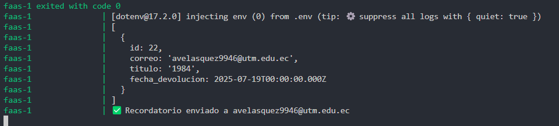
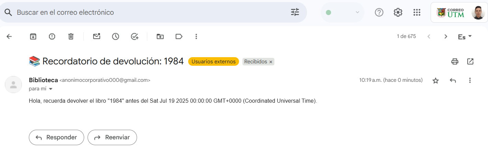

# 📷 Capturas del Sistema

A continuación, se muestra una secuencia visual del funcionamiento de la Biblioteca Digital, desde el registro hasta la recepción del correo recordatorio.

---

## 1️⃣ Registro de usuario 

El usuario se registra enviando un `POST` a `/registro` de forma manual, ya que aún no se ha implementado la interfaz web para el formulario de registro de usuario.

---

## 2️⃣ Inicio de sesión

Se realiza un login exitoso con el usuario registrado anteriormente.

---

## 3️⃣ Visualización del catálogo

Una vez autenticado, el usuario accede al catálogo de libros disponibles.

---

## 4️⃣ Préstamo de libro

Se realiza una solicitud de préstamo para uno de los libros del catálogo, que está configurado para que siempre se tenga la fecha de devolución del libro al día siguiente de modo que facilita la comprobación de la función FaaS con el envío del correo de recordatorio de devolución.

---

## 5️⃣ Historial de libros prestados

El sistema muestra el historial de préstamos registrados por el usuario.

---

## 6️⃣ Ejecución de la función FaaS

Se ejecuta manualmente la función FaaS (`SendDueReminderFn`), que revisa los préstamos y prepara el envío de recordatorios.

---

## 7️⃣ Correo de recordatorio

Finalmente, el usuario recibe un correo con la notificación de que un préstamo está próximo a vencer.

