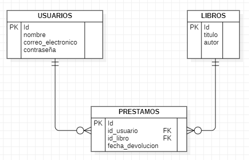

# Base de Datos

## Descripción

La aplicación utiliza MariaDB como sistema de gestión de base de datos relacional para almacenar información sobre usuarios, libros y préstamos.

## Configuración de MariaDB

### Imagen de Docker

La aplicación utiliza la imagen oficial de MariaDB versión 10.11. Esta imagen se configura en el archivo `docker-compose.yml`.

### Variables de Entorno

- `MYSQL_ROOT_PASSWORD`: Contraseña para el usuario root de la base de datos. En este caso, se establece como `root`.
- `MYSQL_DATABASE`: Nombre de la base de datos que se creará al iniciar el contenedor. En este caso, se establece como `biblioteca`.

### Volúmenes

- `db_data`: Volumen para persistir los datos de la base de datos.
- `./sql/init.sql`: Script SQL que se ejecuta al iniciar el contenedor para crear las tablas y cargar datos iniciales.

### Puertos

El contenedor expone el puerto `3306` para permitir conexiones a la base de datos.

### Script SQL de Inicialización

