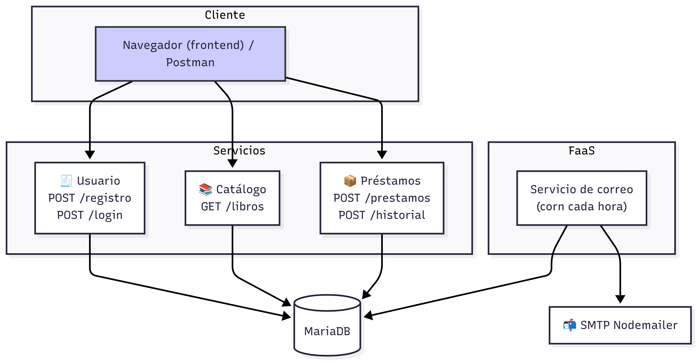

# 📚 Biblioteca Digital

Bienvenido a la documentación técnica del proyecto **Biblioteca Digital**, desarrollado como solución distribuida basada en microservicios, contenedores y funciones FaaS.

## 🔧 Arquitectura General

## 🧱 Componentes

- **Catálogo de libros**: Visualización de libros disponibles.
- **Gestión de préstamos**: Permite solicitar y registrar préstamos.
- **Gestión de usuarios**: Registro y login de usuarios.
- **Función FaaS**: Envío automático de correos recordatorios.

> Proyecto desarrollado con Node.js + Express y documentado con MkDocs + Material.

---

## 🚀 ¿Cómo levantar el proyecto?

docker-compose up --build
