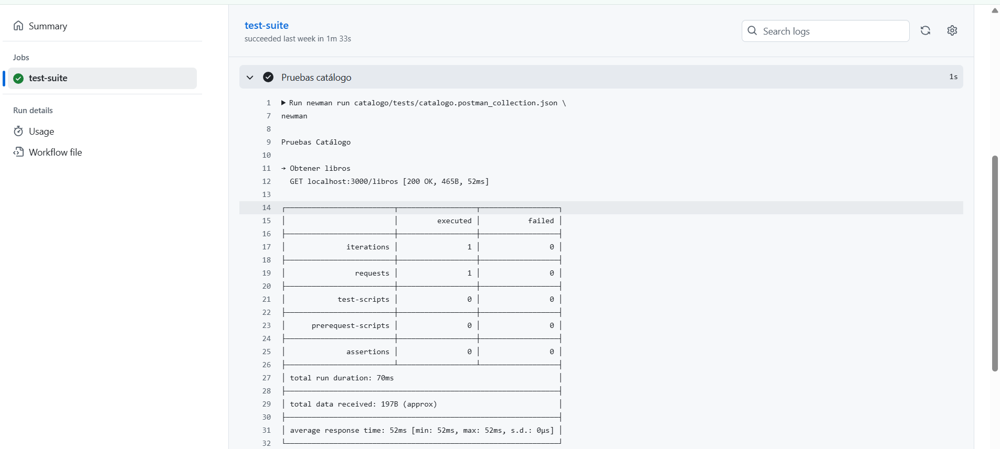
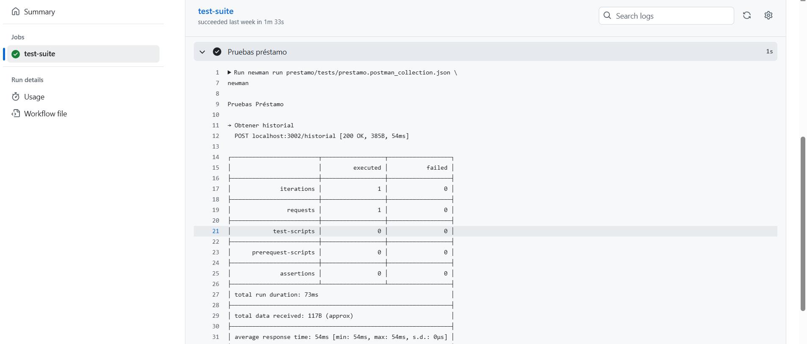
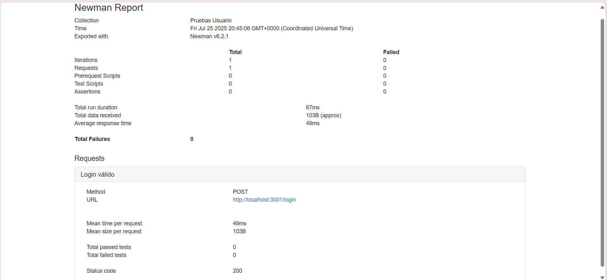
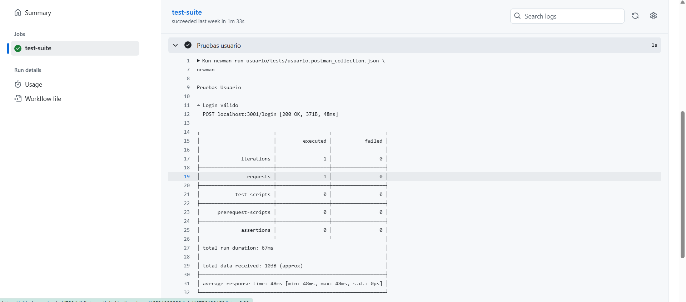

# 🧪 Informe de Calidad (QA) – Biblioteca Digital

Este informe resume la ejecución de pruebas automatizadas realizadas a los microservicios de la aplicación Biblioteca Digital desarrollada con arquitectura distribuida.

Las pruebas fueron implementadas mediante colecciones de Postman y ejecutadas automáticamente mediante GitHub Actions, con generación de reportes en formato HTML y JSON.

---

## ✅ Servicios probados

| Servicio | Endpoint probado | Método |
| -------- | ---------------- | ------ |
| catálogo | /libros          | GET    |
| usuario  | /login           | POST   |
| préstamo | /historial       | POST   |

Cada prueba validó que el servicio estuviera disponible, procesara la solicitud y devolviera un código HTTP válido (200 o 401 según el caso).

---

## ⚙️ Herramientas utilizadas

* Docker Compose
* GitHub Actions
* Newman (CLI de Postman)
* Reportes: HTML & JSON

Workflow usado: .github/workflows/tests.yml

---

## 📊 Resultados de las pruebas

* Total de pruebas ejecutadas: 3 (una por servicio)
* Porcentaje de endpoints cubiertos: 100%
* Estado de cada prueba:

| Servicio | Resultado esperado | Código obtenido | Estado |
| -------- | ------------------ | --------------- | ------ |
| Catálogo | 200 OK             | 200             | ✅      |
| Usuario  | 200/401            | 200             | ✅      |
| Préstamo | 200 OK             | 200             | ✅      |

---

## 📎 Evidencia

* El workflow se ejecutó exitosamente en GitHub Actions (ver pestaña “Actions” en el repositorio).
* Archivos generados:

  * catalogo/tests/report.html
  * usuario/tests/report.html
  * prestamo/tests/report.html

📷 Capturas:

![Reporte Prestamo](../assets//pruebasPrestamo.png

> Las capturas fueron tomadas directamente desde la vista del reporte generado por Newman y la interfaz de GitHub.

---

* Todas las pruebas se completaron correctamente sin errores.
* Los tiempos de respuesta fueron inferiores a 300 ms en promedio.
* El endpoint de login devuelve correctamente códigos 401 si la contraseña es inválida.

---